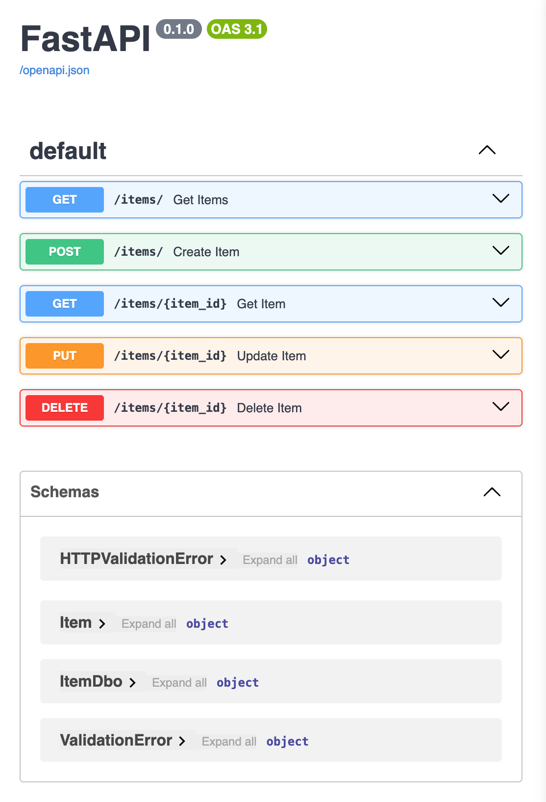

# py-fastapi-mongo
a boilerplate microservice for REST using python, fastapi, and mongo

## setup

### python 
```shell
pip install "fastapi[standard]"
pip install uvicorn motor pymongo
```
_Be sure to use the quotes around fastapi\[standard\]_

### database

Be sure to have mongo and mongosh installed on your local system

Seed the database

```shell
mongosh
test@server.local>use inventory
test@server.local>db.items.insertOne({name: "widget",count:0,partnum:"00-001"})
```
This will create the inventory db and the items collection. Change the values to suit your data model.

## Running
Once setup is done, you should be able to run the server using:
```shell
fastapi dev main.py 
```
Use the --reload option, if you want to the server to restart after you have changed files.
```shell
fastapi dev main.py --reload
```
Now point your browser to http://localhost:8000/items. You should receive a page showing json
output similar to the following:
```json
[{"name":"widget","count":0,"partnum":"00-001","id":"66ae9e533ed60220cf41de0f"}]
```
You can also view the API docs for this service by pointing your browser to http://127.0.0.1:8000/docs

You should see something similar to:


Note that you can test your api using these api docs. For example, you may add items 
using the POST /items endpoint.

### Changing the port

If you want to run it on another port use the --port option when invoking
```shell
PORT=3000 fastapi dev main.py --reload --port 3000
```


